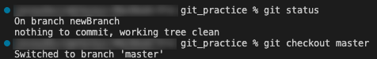

## Git Basics

**What is Git?**

Git is a version control system that can be used in the command line. When you initialize a directory/folder as a git repository, git starts to look for changes in the files in the repository. When a change is made, git tracks that change. When you want to commit a change, first you stage the changes, and then commit them using "git commit." This way, you are saving different versions of the project you are working on.

**Why use Git? What problem does it solve?**

Git is a great way to keep track of versions of your project and keep a running history of changes to it. So, if you introduce code that doesn't work or that you want to get rid of, you can fall back to an earlier version of your project. It also allows for easier collaboration on a project, since it allows for branching and merging versions of the project.

**What is the difference between Git and Github?**

Git is the software that allows you to track versions/changes on your files. It is installed locally on your system. GitHub serves as a hosting service for projects using git, where you can manage your git repos. Its cloud-based and hosted on the web. 

## Git rebase

**What is Git rebase?**

"git rebase" is a command that changes the base commit of a branch. Its a destructive command that essentially rewrites history. Let's say you have a branch with a clear, linear history that is based on a certain commit (let's call it commit3). If you want to change the base commit of that branch to commit2, you can run "git rebase commit2" in the terminal. This will orphan the commits that came after commit2. 

**What are some advantages and disadvantages of Git rebase? (At least 2 of each)**

Some advantages are that it can create a more linear commit history and consolidate commits into a single commit. 

Some disadvantages are that it can make it harder to collaborate it others since it changes the history of the branch, which can cause merge conflicts. It can also cause a loss of commits, as well as make it difficult to see where a particular change was made.

**When shouldn't you use Git rebase? Why?**

It is recommended that you not use git rebase on a branch in which you are collaborating with others. It can cause conflicts and confusion, since they may have cloned and based work off the branch before the rebase happened.

**Create a new repo and demonstrate your knowledge of the following items with screenshots:**

*A rebase merge*

In above example, you can see two branches: master and newFeature. The branch newFeature was originally based off of the 64f943 commit. But after running "git rebase master" on the newFeature branch, it replays the commits in newFeature onto the master branch. This creates a rebase merge and a linear line of history.

*An interactive rebase merge*

These instructions are produce after running "git rebase 4036198 -i" on one of my branches (4036198 is simply the hash for the specific commit I want to rebase to). An interactive rebase merge allows you to make changes to multiple commits at once. This is done by adding a -i after a rebase command. 

*When you shouldn't rebase with a remote repo.*

Rebasing with a remote repo can sometimes cause issues, especially if you're working with others. Other developers may have cloned based work off of a branch before it was rebased, which will likely cause conflicts will trying to push their work.

## Git reset, checkout, and revert

**What is Git reset?**

A git reset is a command that points the current branch and head to a previous commit and orphans the commits after that previous commit. It is destructive, since those orphaned commits will no longer be accessible. It is different from a rebase since rebase will "replay" the commits after the commit you're rebasing to on to another branch, while reset does not. Reset is essentially undoing commits.

**What is the difference between hard, mixed and soft?**

A hard reset resets the working directory, the staging directory, and the commit history. A soft reset only resets the commit history. A mixed reset will reset the staging directory and the commit history.

**What is Git checkout?**

Git checkout allows you to move the head onto a new branch. If you are on branch master and you have another branch called newFeature, to move the head to the newFeature branch you can run git checkout newFeature in the terminal. 

**What is Git revert?**

Git revert is a command that allows you point the head back to a previous commit by creating a revert commit. It essentially undoes commits, but without orphaning them. It does not rewrite history, since you can still view those previous commits.

**In what ways are these commands the same and what ways are they different?**

Git revert is similar to git reset in that it undoes the changes done after the commit you're reverting back to, but instead of orphaning those commits, it creates a revert commit. It does not rewrite history. Checkout does not remove, create, or change any commits. It simple moves the head to a specified branch or commit. All three of these commands change the location of the head.

**When would you use reset, checkout, or revert? Why?**

Since git reset orphans the discarded commits and makes them inaccessible, it would be used when you make a mistake and want to start over with a clean history. 

You can use checkout when you want to move between branches in a git repository.

Git revert is useful when you want to rollback to a previous commit, but want to keep an accurate history of the changes made to the repo. It does not orphan the unwanted commits, so you can go back to them later if you want to. 

**Create a new repo and demonstrate your knowledge of the following items with screenshots:**

*a Git reset*

In this visualization, the command "git reset b784be7" was run, which moved the branch and head to the commit with the hash b784be7. The commits that were made after that commit are now orphaned, indicated by the dotted lines. Those commits are no longer accessible.

*a Git checkout*

In this screenshot, you can see how the current working directory is in the branch newBranch. But after running "git checkout master," it moves the head to the branch master.

*a commit*

In the screenshot, the command "git commit" was run with the message of "new section." This created a new commit. As you can see, one file was changed. 

*a Git revert*

In this visualization, the command "git revert b784be7" was run, which created a new commit (a revert commit) which looks the same was commit b784be7. It does not orphan the commits after b784be7, but it does remove their changes. But they can still be accessed later if needed. 

## Git submodules

**What are Git submodules?**

Git submodules are git repositories inside of git repositories. The submodule references a specific commit of that repo. The commits of each repository are separate, so they can evolve independently. 

**When would you use a submodule?**

You would use submodules when you want to connect different repositories that depend on each other. It can also help to split a large project into more managable pieces. 

**What are the advantages and disadvantages of Git submodules?**

Git submodules can be helpful in several ways. They are an easy way to manage your dependencies without having to copy the code in your repo. It allows for easy updating. It also is good for collaboration, since you can include code developed by other people and still keep track of the original source. 

Some disadvantages are the fact that they can be complex, so a deeper understanding of git is required to use them. It also makes sharing difficult, since people will have to clone and intialize all the submodules if they want to clone your project. And it can be difficult to keep the main repo and the submodules in sync since they are updated separately from the main repository.
